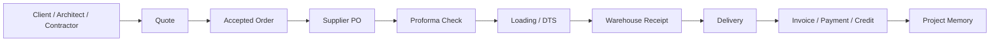

# Business Model Map

## Revenue streams

1. Retail showroom sales
2. Architect/designer specified projects
3. Contractor/developer orders
4. Hotel/villa material supply
5. Scavolini kitchens
6. Outdoor material supply
7. Bathroom packages
8. Large slabs and premium surfaces
9. Potential future e-shop / Stock House
10. Potential consulting/design specification services

## Value chain

## Customer types

| Segment | Needs | Afoi Deli advantage |
|---|---|---|
| Retail homeowner | Guidance, trust, aesthetics | Showroom + curated brands |
| Architect | Samples, technical certainty, alternatives | Supplier network + product knowledge |
| Interior designer | Mood, finish, premium options | Editorial product selection |
| Contractor | Timely delivery, clear pricing, reliability | Logistics + batching |
| Hotel/villa owner | Full package, durability, luxury | Premium materials + specification |
| Developer | Scale, consistency, credit, speed | Supplier relationships + process |

## Profit levers

- Higher-margin suppliers
- Better batching/loading optimization
- Fewer wrong orders
- Faster proforma checking
- Better quote validation
- Clearer delivery/payment timing
- Stocked products strategy
- Website-generated qualified leads
- Premium specification packages
- Scavolini upsell and full-home packages

## Cost / risk levers

- Mistyped codes
- Wrong quantities
- Packaging mismatches
- Delayed loadings
- Poor supplier communication
- Unclear client payment status
- Warehouse receiving mistakes
- Partial arrivals
- Credit period mismatch
- Manual double entry
