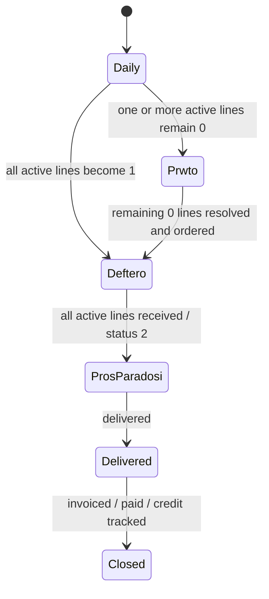

# Folder State Machine

## Purpose

Make folder movement logical and eventually automatable.

## States



## Folder definitions

### Daily
Temporary active intake.

### Prwto
Order has unresolved or unordered lines.

### Deftero
Order is ordered but not fully received.

### Pros Paradosi
Order is received and needs delivery/payment coordination.

## Important rule

Folder state should be **derived**, not manually guessed.

Future formula:

```text
folder_state =
IF any active line status = 0 → Prwto
ELSE IF all active lines status = 1 → Deftero
ELSE IF all active lines status >= 2 → Pros Paradosi
```

## Edge cases

- WAIT row: ignore only if wait_type = row.
- Cancelled line: exclude from active line count.
- Partial arrival: parent remains Deftero unless delivery can be split.
- Mixed supplier arrival: show both order-level and line-level status.
