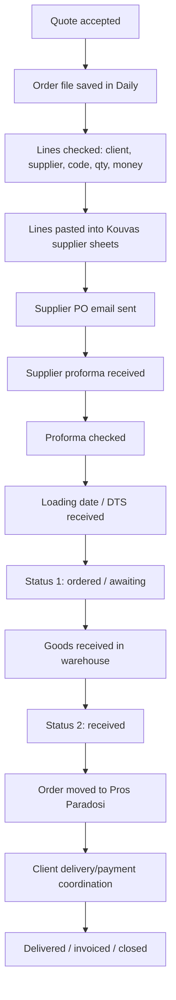

# Operations Map

## Core operating chain

## Current state folders

- **Daily** — new or changed orders, with lines often at status 0.
- **Πρώτο / Prwto** — at least one line remains status 0 or unresolved.
- **Δεύτερο / Deftero** — all relevant lines are ordered / status 1.
- **Προς Παράδοση / Pros Paradosi** — all relevant lines received / status 2 and ready for delivery.
- **Kouvas.xlsx** — master supplier bucket file, one sheet per supplier.

## Status model

| Status | Meaning | Folder implication |
|---|---|---|
| 0 | Not ordered yet | Daily / Prwto |
| 1 | Ordered, awaiting loading/arrival | Deftero |
| 2 | Received in warehouse | Pros Paradosi |
| 3 | Delivered | Future extension |
| 4 | Invoiced / financially closed | Future extension |

> Full status definitions and the required-fields gate at each step: [[Order Workflow 0-4]] — the canonical 0–4 spine this table summarises.

## Most important operational principle

An order is not a file.  
An order is a living group of product lines, each with its own supplier, status, loading, receipt, delivery, and financial reality.

## Core SOPs

- [[02_OPERATIONS_OS/Daily Order Processing SOP]]
- [[02_OPERATIONS_OS/Kouvas System]]
- [[02_OPERATIONS_OS/Folder State Machine]]
- [[02_OPERATIONS_OS/Supplier PO Creation SOP]]
- [[02_OPERATIONS_OS/Proforma Checking SOP]]
- [[02_OPERATIONS_OS/DTS and Loading Date SOP]]
- [[02_OPERATIONS_OS/Warehouse Receiving SOP]]
- [[02_OPERATIONS_OS/Delivery Scheduling SOP]]
- [[02_OPERATIONS_OS/Finance and Credit Terms SOP]]
- [[02_OPERATIONS_OS/Exception Handling Rules]]
