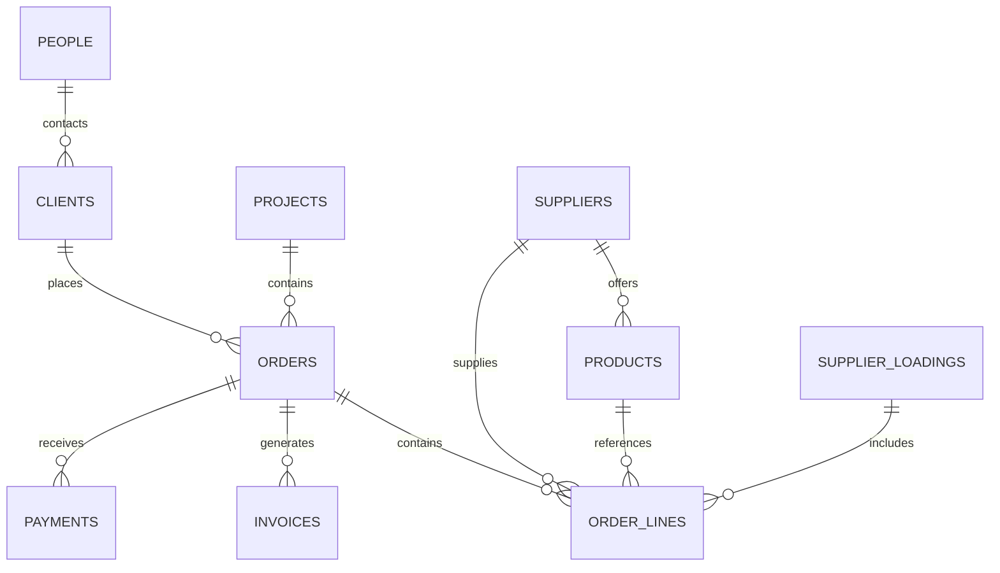

# Database Master Schema

## Purpose

This is the bridge from Obsidian to the future database / ERP and dashboards — the settled **Supabase Postgres + Python worker** stack (no n8n; see [[Automation Masterplan]] / [[Python Worker Map]]).

## Core entities



## Tables — schema note ↔ CSV (source of truth)

> [!important] One source of truth per entity (audit P0-2, 2026-06-16)
> For every entity the **`.csv` header in `97_CSV_SCHEMAS` is the canonical stored contract**; the `.md` schema note *annotates* it (types, relationships, derived fields, controlled-value lists). A field must not exist on one side and silently not the other. Verified in sync 2026-06-16 except where noted.

| Entity | Schema note | Stored contract (`97_CSV_SCHEMAS`) | Parity |
|---|---|---|---|
| Orders | [[Orders Schema]] | `orders.csv` | ✓ stored cols match; 4 derived fields annotated, not stored |
| Order lines | [[Order Lines Schema]] | `order_lines.csv` | ✓ in sync |
| Clients | [[Clients Schema]] | `clients.csv` | ✓ in sync |
| Suppliers | [[Suppliers Schema]] | `suppliers.csv` | ✓ in sync |
| Products | [[Products Schema]] | `products.csv` | ✓ in sync |
| Projects | [[Projects Schema]] | `projects.csv` | ✓ in sync |
| Invoices — supplier (AP) | [[Invoices and Payments Schema]] | `supplier_invoices.csv` | ✓ split from old unified CSV |
| Invoices — client (AR) | [[Invoices and Payments Schema]] | `client_invoices.csv` | ✓ split from old unified CSV |
| Supplier loadings | [[Supplier Loadings Schema]] | `supplier_loadings.csv` | ✓ in sync |
| Tasks & alerts | [[Tasks and Alerts Schema]] | `tasks_alerts.csv` | ✓ in sync |
| Issues & exceptions | [[Issues and Exceptions Schema]] | `issues_exceptions.csv` | ✓ in sync |

> [!note] Known gap (P2)
> The ERD names a `PEOPLE` entity and a `PAYMENTS` flow with no schema note or CSV. `PEOPLE` is unbuilt; `PAYMENTS` is currently folded into `client_invoices` (`balance_due` / `payment_status`), not a separate table. Build out only if the model needs them.

## ID convention

Use stable IDs:

| Entity | Format |
|---|---|
| Order | ORD-YYYYMMDD-CLIENT |
| Order line | OL-YYYYMMDD-CLIENT-001 |
| Supplier | SUP-SUPPLIERNAME |
| Product | PROD-SUPPLIER-CODE |
| Client | CLI-NAME |
| Project | PROJ-NAME |
| Invoice | INV-YYYY-NUMBER |
| Loading | LOAD-SUPPLIER-YYYYMMDD |

## Obsidian frontmatter convention

Every structured note should have:

```yaml
type:
status:
created:
updated:
owner:
source:
source_file:
related:
next_action:
```

## Status & confidence conventions

Note frontmatter `status` and `confidence` follow the **single declared sets in `CLAUDE.md §3`** — do not redeclare a divergent vocabulary here (that drift was caught by the [[2026-06-16-vault-audit|audit]]). For *record-level* workflow state inside the database tables (distinct from note frontmatter), use:

```yaml
priority: low | medium | high | critical
automation_priority: low | medium | high | very_high
```
