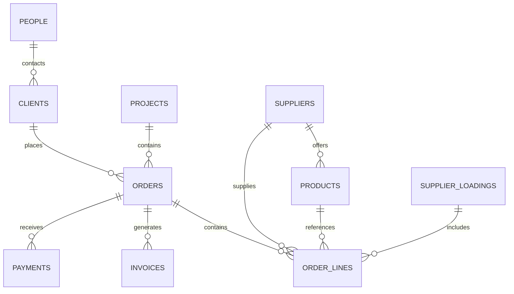

# Database Master Schema

## Purpose

This is the bridge from Obsidian to future database / ERP / n8n / dashboard.

## Core entities



## Tables / note types

- [[03_DATABASE_DESIGN/Orders Schema]]
- [[03_DATABASE_DESIGN/Order Lines Schema]]
- [[03_DATABASE_DESIGN/Clients Schema]]
- [[03_DATABASE_DESIGN/Suppliers Schema]]
- [[03_DATABASE_DESIGN/Products Schema]]
- [[03_DATABASE_DESIGN/Projects Schema]]
- [[03_DATABASE_DESIGN/Invoices and Payments Schema]]
- [[03_DATABASE_DESIGN/Supplier Loadings Schema]]
- [[03_DATABASE_DESIGN/Tasks and Alerts Schema]]
- [[03_DATABASE_DESIGN/Issues and Exceptions Schema]]

## ID convention

Use stable IDs:

| Entity | Format |
|---|---|
| Order | ORD-YYYYMMDD-CLIENT |
| Order line | OL-YYYYMMDD-CLIENT-001 |
| Supplier | SUP-SUPPLIERNAME |
| Product | PROD-SUPPLIER-CODE |
| Client | CLI-NAME |
| Project | PROJ-NAME |
| Invoice | INV-YYYY-NUMBER |
| Loading | LOAD-SUPPLIER-YYYYMMDD |

## Obsidian frontmatter convention

Every structured note should have:

```yaml
type:
status:
created:
updated:
owner:
source:
source_file:
related:
next_action:
```

## Status conventions

Use controlled values where possible:

```yaml
status: draft | active | waiting | blocked | completed | archived
priority: low | medium | high | critical
automation_priority: low | medium | high | very_high
confidence: low | medium | high | verified
```
