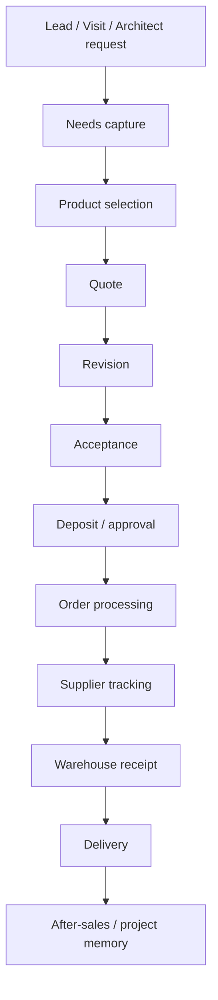

# Sales and Client Experience Map

## Core journey

## Experience goal

The client should feel:

- guided
- understood
- protected from mistakes
- updated without chasing
- dealing with a premium but human company

> The craft behind **Product selection** — how a brief becomes a specified, sold scheme — is documented in [[The Selection Engine]] (the conversion half of the [[Afoi Deli — Operating Doctrine|uplift engine]]).

## Core templates

- [[98_TEMPLATES/Template - Client]]
- [[98_TEMPLATES/Template - Project]]
- [[98_TEMPLATES/Template - Order]]
- [[05_SALES_AND_CLIENT_EXPERIENCE/Client Intake Checklist]]
- [[05_SALES_AND_CLIENT_EXPERIENCE/Quote Creation Checklist]]
- [[05_SALES_AND_CLIENT_EXPERIENCE/Premium Human Email Tone]]
- [[05_SALES_AND_CLIENT_EXPERIENCE/Ready For Delivery Message]]
