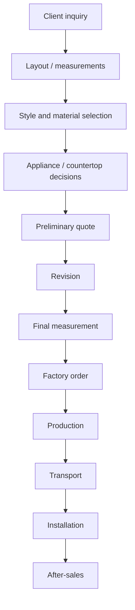

# Kitchen Knowledge Map

## Why this matters

Kitchens can move Afoi Deli from material distribution to full interior package authority.

## Knowledge sections

- Kitchen models
- Door materials
- Lacquer vs veneer vs laminate
- Countertops
- Appliances
- Handles
- Lighting
- Storage systems
- Islands and bars
- Measurements
- Site readiness
- Installation
- Transport
- After-sales

## Scavolini workflow



## Fields for kitchen projects

```yaml
kitchen_model:
door_material:
finish:
countertop:
appliances_included:
installation_included:
transport_included:
measurement_status:
drawings_status:
quote_status:
factory_order_status:
```
