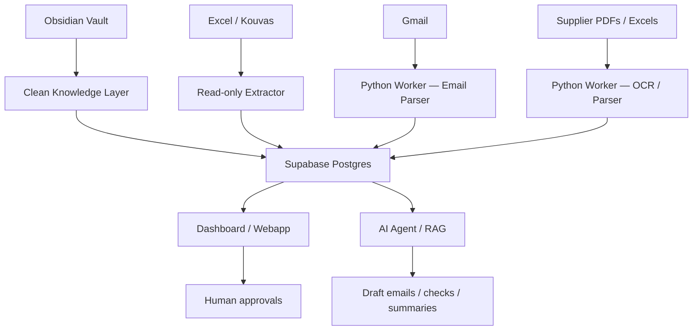

# Automation Masterplan

## North star

Build a company control tower where every order, supplier, product, loading, proforma, invoice, delivery, and client promise is visible and actionable.

## Recommended architecture

> [!info] Settled stack
> **Supabase Postgres** for data, a **Python worker** for parsing/automation, bilingual from day one, solo build via Claude Code. **No n8n.** The worker replaces what an external workflow tool would have done.

## Layers

### Layer 1 — Knowledge
Obsidian stores SOPs, rules, supplier notes, product logic, decisions.

### Layer 2 — Data
**Supabase Postgres** stores structured operational data. Single source of truth for state.

### Layer 3 — Automation
The **Python worker** watches Gmail, files, and data changes; parses; writes to Postgres; drafts outputs. Scheduled and event-triggered jobs (see [[Python Worker Map]]).

### Layer 4 — Interface
Dashboard / webapp shows order health, statuses, supplier loadings, client pages.

### Layer 5 — AI agent
AI reads the knowledge layer and data layer to assist, not hallucinate.

## First automations to build

1. Kouvas read-only snapshot
2. Daily folder order intake scanner
3. Proforma attachment collector
4. Supplier loading/DTS parser
5. Order health dashboard
6. Ready-for-delivery draft generator
7. Supplier follow-up reminder
8. Packaging mismatch checker
9. Credit/due date reminder
10. Weekly operations summary

## Golden rule

No automation should send external communication without human approval until it has proven itself. (See [[Afoi Deli — Operating Doctrine#The responsibility doctrine]] — the client holds Afoi Deli accountable, so nothing goes out unchecked.)

## Links

- Worker jobs → [[Python Worker Map]]
- Schemas → [[Database Master Schema]]
