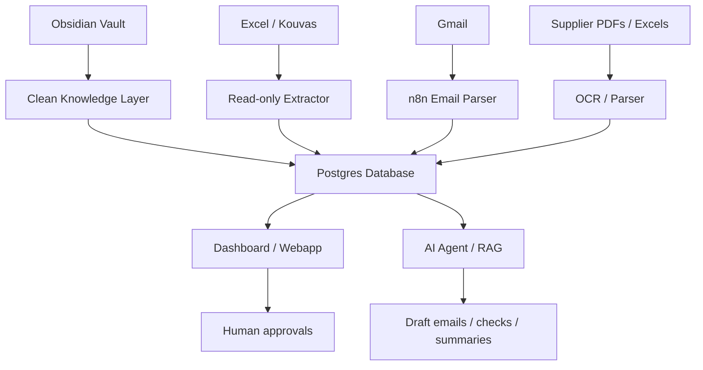

# Automation Masterplan

## North star

Build a company control tower where every order, supplier, product, loading, proforma, invoice, delivery, and client promise is visible and actionable.

## Recommended architecture

## Layers

### Layer 1 — Knowledge
Obsidian stores SOPs, rules, supplier notes, product logic, decisions.

### Layer 2 — Data
Postgres or similar stores structured operational data.

### Layer 3 — Automation
n8n watches Gmail, files, and data changes.

### Layer 4 — Interface
Dashboard / webapp shows order health, statuses, supplier loadings, client pages.

### Layer 5 — AI agent
AI reads the knowledge layer and data layer to assist, not hallucinate.

## First automations to build

1. Kouvas read-only snapshot
2. Daily folder order intake scanner
3. Proforma attachment collector
4. Supplier loading/DTS parser
5. Order health dashboard
6. Ready-for-delivery draft generator
7. Supplier follow-up reminder
8. Packaging mismatch checker
9. Credit/due date reminder
10. Weekly operations summary

## Golden rule

No automation should send external communication without human approval until it has proven itself.
