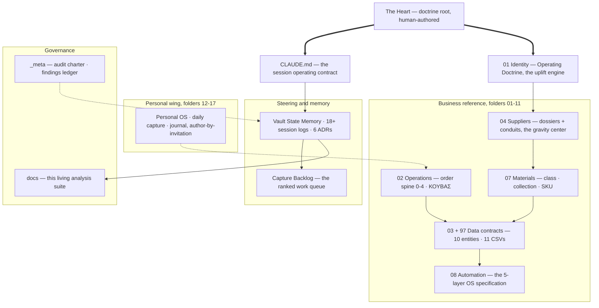
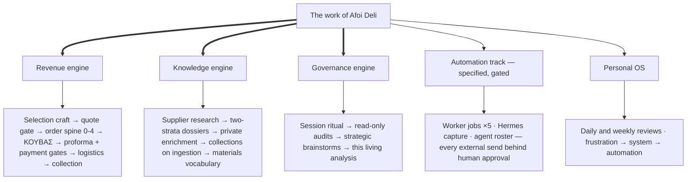
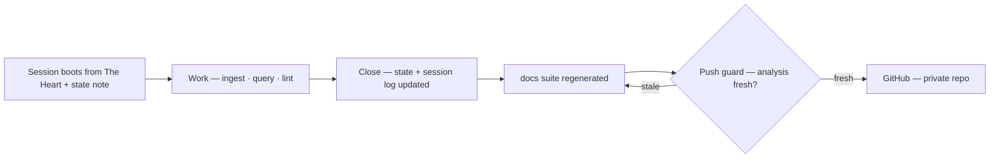
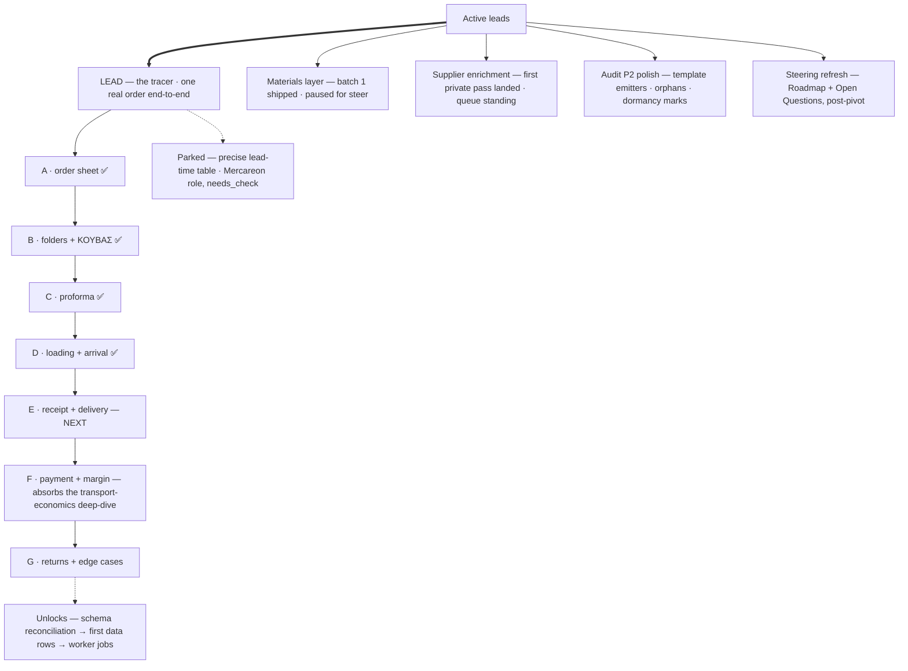

# AFOI DELI — Knowledge & Operating Vault

Private Obsidian vault and operating system for **Afoi Deli Floor + Bath** (Athens) **and Orfeas Delis as a person** — business and personal are one fabric by design. Knowledge layer for operations, suppliers, products, projects, automation, and the future Afoi Deli OS.

> **Private repository.** Contains supplier, client, and financial knowledge. Do not make public.

<!-- REPO-ANALYSIS:BEGIN — generated by /repo-analysis · do not edit inside these markers -->
*Generated 2026-07-02 · Analysis v1.2 · every number below is computed, never estimated · regenerated on every push/pull (`CLAUDE.md` §8, ADR-0006)*

## Abstract

This repository documents a live experiment in **operational knowledge engineering**: the systematic compilation of a second-generation family merchant's tacit knowledge — supplier truth, selection craft, process reality, doctrine — into a governed, confidence-graded, machine-actionable corpus. The subject is Afoi Deli Floor + Bath, an Athens distributor of premium architectural surfaces founded 1986; the observer-participant is its successor, working the succession itself as an engineering problem. The method is an LLM-maintained wiki with one deliberate deviation from the pattern's default: an **authorship line** that separates machine-maintained reference (dossiers, schemas, this analysis) from human-authored doctrine (`The Heart.md`, the journal, the decisions). Three properties distinguish the approach: every factual note carries an explicit confidence grade on a four-value scale; ground truth captured from one real transaction overrides idealized process documentation wherever they disagree; and the corpus is **self-describing under enforcement** — a guard blocks any push whose commits change notes without regenerating the analysis you are reading. The end state under construction is a five-layer operating system (knowledge → data → automation → interface → agent) of which, by the corpus's own honest accounting, only the knowledge layer currently runs.

**Keywords:** operational knowledge engineering · LLM-maintained wiki · second brain · family-business succession · tacit-knowledge capture · confidence grading · human-in-the-loop automation · ERP specification

## 1 · System snapshot

| Measure | Value |
|---|---|
| Notes | 187 across 21 note-bearing folders (23 top-level directories) |
| Wikilinks | 1,718 total · 95.7% resolved · 1,030 unique note→note edges |
| Confidence-graded notes | 54 (`verified` 29 · `memory_seed` 12 · `likely` 10 · `needs_check` 3) |
| Top conceptual hubs | `Vault State Memory` · `Capture Backlog` · `The Heart` · `Supplier - Kronos` |
| Lead thread | The tracer — one real order end-to-end; batch D of A–G settled |
| OS build state | Layer 1 of 5 running · 11 CSV data contracts, zero rows |

Full metrics, hub tables, and the risk register: [docs/REPO_ANALYSIS.md](docs/REPO_ANALYSIS.md).

## 2 · Structure — how the corpus is organized

A numbered-folder taxonomy under a doctrine root that sits *above* the structure. Knowledge flows downward from doctrine into domains; state flows through the memory spine; everything is audited from `_meta` and described from `docs`.



*Solid `-->` = explicit structural flow · dashed `-.->` = inferred dependency · thick `==>` = doctrine descent. Full architecture with prose: [docs/REPO_ANALYSIS.md](docs/REPO_ANALYSIS.md) §3; the canonical folder index is `99_SYSTEM/Vault Map.md`.*

## 3 · Method — how the machine runs

Three engines carry the work; a fourth track is specified but deliberately unbuilt until the data layer is real.



Every session runs one standing loop — **ingest** (sources are discussed, then filed with frontmatter + confidence), **query** (answers become notes, not chat history), **lint** (drift is surfaced, never silently fixed) — under hard approval gates: the assistant drafts, a human approves anything external or financial (`CLAUDE.md` §4/§6). The loop closes structurally:



*Full workflow flowcharts with owners and decision gates: [docs/REPO_ANALYSIS.md](docs/REPO_ANALYSIS.md) §6 · the complete hierarchy: [docs/WORKFLOW_TREE.md](docs/WORKFLOW_TREE.md).*

## 4 · Leads — where the work currently stands

The active threads, as recorded in `14_AI_COLLABORATION/Vault State Memory.md` §5 (the single source of truth for "where we are"). The lead thread follows the **instance-first** doctrine: one real, closed, ordinary-with-a-wrinkle order is walked end-to-end before any automation is built — *"explain reality first; everything else is derived and adjusted to this."*



*✅ = batch settled · NEXT = the resume point. The tracer's findings compound into a schema-corrections list (21 items to date) that will reconcile the idealized SOPs and the 11 data contracts to reality.*

## 5 · Verification & provenance

No number in this section was estimated: metrics come from a deterministic UTF-8-safe scanner (`.claude/skills/repo-analysis/scripts/vault_metrics.py`); the qualitative analysis was produced by twelve parallel domain readers over all 187 notes, with per-claim evidence paths and an explicit stated-vs-inferred distinction; drafts pass a deterministic citation check (every cited path must exist) and adversarial review by independent verifier agents before commit — the review has teeth (it has failed a draft and forced fixes, including quote-fidelity and confidentiality corrections). Concrete commercial figures are never restated in this suite; the notes holding them are cited instead. The personal wing is described structurally only. Method detail: [docs/REPO_ANALYSIS.md](docs/REPO_ANALYSIS.md) §10.

## 6 · Vision & trajectory

The stated north star (`01_COMPANY_CORE/Afoi Deli Master Profile.md`): *"to become the most intelligent, design-aware, operationally precise architectural material distributor in Greece — and then turn that intelligence into a platform, content engine, and potentially a new category of construction/material operating system."* Two convictions govern the build: **the moat is the uplift engine, not the brand portfolio** — the house's staging-plus-conversion capacity that makes any carried brand more premium than it is alone — and **business and personal are one fabric**, on the premise that the company only becomes as clear, disciplined, and powerful as its operator's own system. Trajectory: finish the tracer → reconcile specification to reality → first real data rows → read-only worker jobs behind approval gates → the operations cockpit as the working interface → and only after internal proof, the intelligence turned outward. Full analytical description: [docs/VISION.md](docs/VISION.md).

**The corpus:** [Full profile](docs/REPO_ANALYSIS.md) · [Workflow tree](docs/WORKFLOW_TREE.md) · [Family tree](docs/FAMILY_TREE.md) · [Relationship trees](docs/RELATIONSHIP_TREES.md) · [Vision & roadmap](docs/VISION.md)
<!-- REPO-ANALYSIS:END -->

## Where to start
- **In Obsidian:** `The Heart.md` (doctrine root — read first) → `14_AI_COLLABORATION/Collaboration Home.md` (working hub). Canonical folder index: `99_SYSTEM/Vault Map.md`.
- **For Claude / AI sessions:** `CLAUDE.md` (root) defines operating instructions; memory lives in `14_AI_COLLABORATION/Vault State Memory.md`.
- `README_START_HERE.md` is a pre-pivot historical artifact — do not treat it as current doctrine.

## Sync workflow
```bash
git add -A
git commit -m "<type>: <summary>"   # feat | fix | docs | chore | refactor
git push
```
Full routine and session memory protocol: `14_AI_COLLABORATION/Session Protocol.md`. The end-of-session ritual (`CLAUDE.md` §8) refreshes `docs/REPO_ANALYSIS.md` before the commit; a push guard enforces it.

On a **fresh clone**, activate the repo's git hooks once:
```bash
git config core.hooksPath .githooks
```

## Plugins
Dataview, Templater, Obsidian Git — see `14_AI_COLLABORATION/Obsidian Plugin Setup.md`.

## Principle
Obsidian is the memory. Structured files/data are the source of truth — never the AI. Humans approve all external/risky actions.
