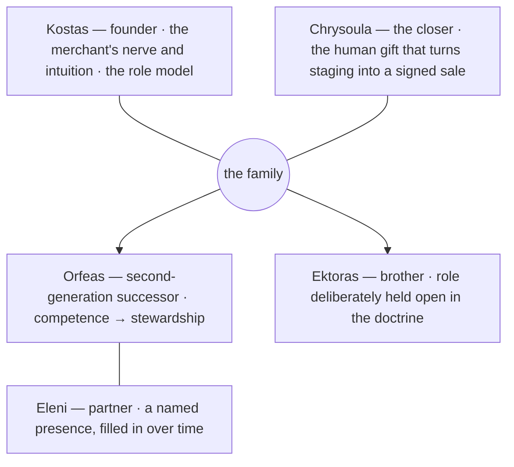
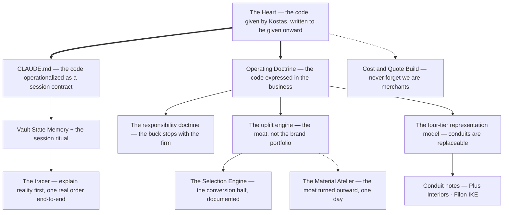

# Afoi Deli — Family Tree

**Generated 2026-07-19b · snapshot ff3c968** (body unchanged since 2026-07-02 — no people-layer change) by the `/repo-analysis` skill — regenerated at every session end (`CLAUDE.md` §8, ADR-0006). **Do not hand-edit.** Role-level only by rule: the people are described by their documented roles in the business and doctrine, never by personal content (the personal wing is author-by-invitation, `CLAUDE.md` §5).

Two family trees live in this repo: the **house of Deli** (the people), and the **lineage of ideas** (what descends from The Heart). Both are drawn from Orfeas-authored doctrine; this file only compiles them.

---

## 1. The house of Deli — the family as commercial instruments

Sources: `The Heart.md`, `01_COMPANY_CORE/Afoi Deli — Operating Doctrine.md` (the "family as commercial instruments" section), `00_COMMAND_CENTER/Capture Backlog.md` (people priorities), `15_PERSONAL_LIFE/Relationships/Relationships.md`.

*Legend: plain `---` = family bond · arrow `-->` = generational descent. Labels are the doctrine's own words.*

What the doctrine says about this tree (stated, cited):

- **The founder's seat:** Kostas is the founder and the role model — the merchant's nerve and intuition; strategy, exceptions, and supplier relationships sit with management in the roles map (`The Heart.md`, `01_COMPANY_CORE/People and Roles Map.md`). What The Heart says about the engine beneath the engine stays in The Heart — it is read there, not compiled here.
- **The succession arc:** value is *an obligation, not a given position*; the successor owes value forward, renewed daily (`The Heart.md`, the two maxims). The real work of succession is the shift from doing the work well to holding the whole at a standard.
- **The commercial split:** staging (the room, the taste, the discretion) + conversion (Chrysoula — *"can sell ice to Eskimos"*) are the two personified halves of the uplift engine (`01_COMPANY_CORE/Afoi Deli — Operating Doctrine.md`).
- **Deliberately open:** Ektoras's role is marked *"(to be described — room left open)"* in the doctrine — an intentional blank, not an omission. Eleni's note begins as a named presence in `15_PERSONAL_LIFE/Relationships/Relationships.md` (Capture Backlog Priority 1).

**A generational mirror across the table (stated):** at the vault's central conduit, succession is happening on both sides at once — **George Tzanidis**, son of principal **Kostas Tzanidis**, is now in Plus Interiors and is roughly Orfeas's age (`04_SUPPLIERS_AND_BRANDS/Conduit - Plus Interiors.md`). The relationship network around the house is drawn in `docs/RELATIONSHIP_TREES.md`.

---

## 2. The lineage of ideas — the vault's own family tree

Every governing idea in this repository descends from one root note. Descent below is **stated** where a note explicitly declares its parent (solid arrows) and **inferred** from quotation/derivation (dashed).

*Legend: thick `==>` = declared descent ("descends from The Heart") · solid `-->` = stated derivation · dashed `-.->` = inferred derivation (the note quotes or extends the parent).*

Evidence for each edge: `01_COMPANY_CORE/Afoi Deli — Operating Doctrine.md` declares "The Heart is the source; this is its expression in the business"; `05_SALES_AND_CLIENT_EXPERIENCE/The Selection Engine.md` roots itself in The Heart and the Operating Doctrine; `10_FINANCE_AND_MANAGEMENT/Cost & Quote Build.md` opens on The Heart's merchant maxim; `16_IDEAS_AND_VISION/The Material Atelier.md` positions the venture as the uplift moat "turned outward into a product"; the tracer doctrine ("explain reality first; everything else is derived and adjusted to this") is recorded in `14_AI_COLLABORATION/Vault State Memory.md` §5 and `00_COMMAND_CENTER/Capture Backlog.md`.

The founding act that seeded the supplier tree also belongs to this lineage: Kostas pointed Tzanidis toward representing **Cielo** — *creating the circumstances* rather than asking — and the conduit relationship followed as a consequence (`04_SUPPLIERS_AND_BRANDS/Suppliers/Cielo/Supplier - Cielo.md`, `04_SUPPLIERS_AND_BRANDS/Conduit - Plus Interiors.md`).
