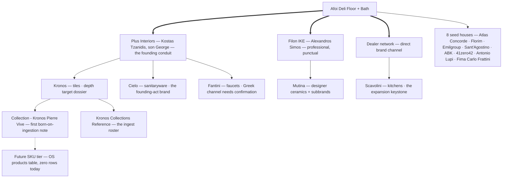
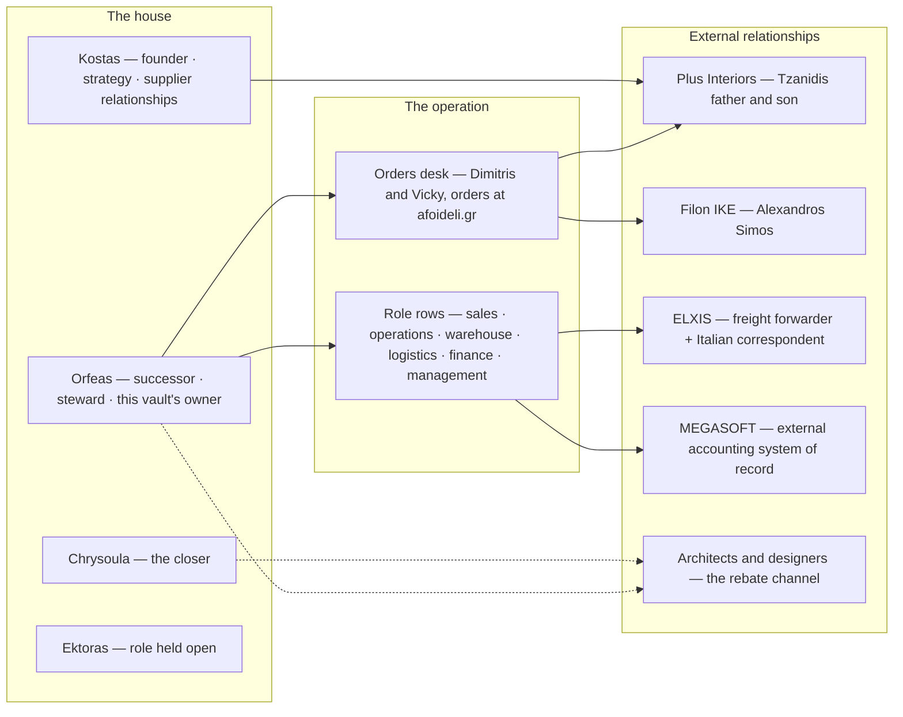
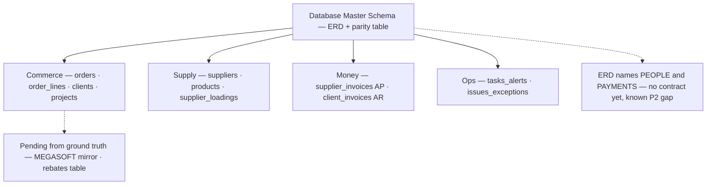
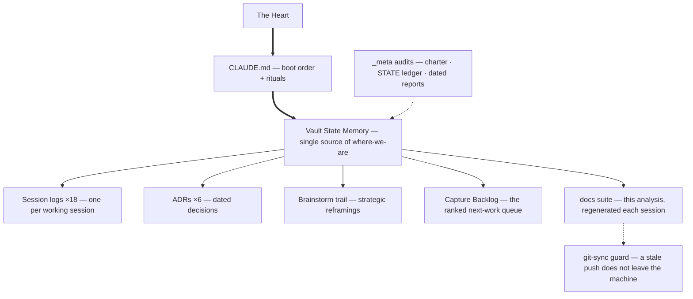

# Afoi Deli — Relationship Trees

**Generated 2026-07-02** by the `/repo-analysis` skill — regenerated at every session end (`CLAUDE.md` §8, ADR-0006). **Do not hand-edit.**

Four trees: the supply ecosystem, the people around the operation, the data-contract family, and the memory spine. Quantitative link-graph numbers (hub degrees, edge counts) live in `docs/REPO_ANALYSIS.md` §2/§7 — one source of truth per number. The human family itself is drawn in `docs/FAMILY_TREE.md`.

## 1. The supply ecosystem — house → conduits → brands → collections

Sources: `04_SUPPLIERS_AND_BRANDS/Supplier Master Index.md`, the conduit notes, the Kronos subtree.

*Legend: thick `==>` = live commercial channel · solid `-->` = documented relationship · dashed `-.->` = future/specified. The power-geometry doctrine on every conduit edge: the conduit is replaceable, the brand is not, and the client always turns to Afoi Deli (`04_SUPPLIERS_AND_BRANDS/Conduit - Plus Interiors.md`).*

## 2. The people around the operation

Sources: `01_COMPANY_CORE/People and Roles Map.md`, `01_COMPANY_CORE/Afoi Deli — Operating Doctrine.md`, tracer ground truth (`02_OPERATIONS_OS/Order Lifecycle — Ground-Truth Capture.md`).

*Legend: solid `-->` = documented working relationship · dashed `-.->` = inferred relationship channel. Per-step ownership of the six critical order gates is deliberately unresolved in `01_COMPANY_CORE/People and Roles Map.md` — an open question the tracer is closing.*

## 3. The data-contract family — one master, ten entities, eleven CSVs

Source: `03_DATABASE_DESIGN/Database Master Schema.md` (the md↔csv precedence rule: CSV header is the stored contract, the note annotates).

*Legend: solid `-->` = entity pairs in sync (md note + CSV header) · dashed `-.->` = acknowledged gaps. All 11 CSVs are header-only — the data layer is a specification awaiting its first real rows.*

## 4. The memory spine — how the repo remembers

*Legend: thick `==>` = the literal boot chain · solid `-->` = maintained-at-session-end artifacts · dashed `-.->` = enforcement/reconciliation feedback. The loop closes at the guard: every push carries the state that describes it.*
