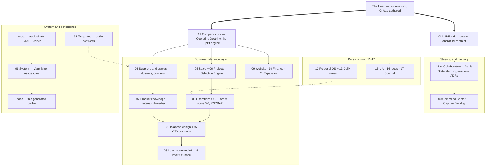
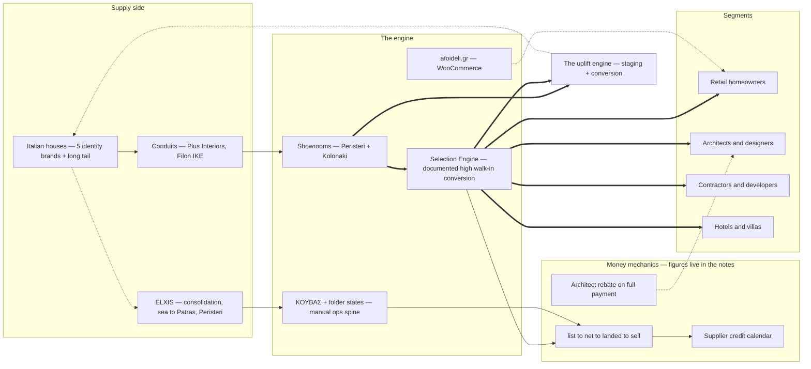
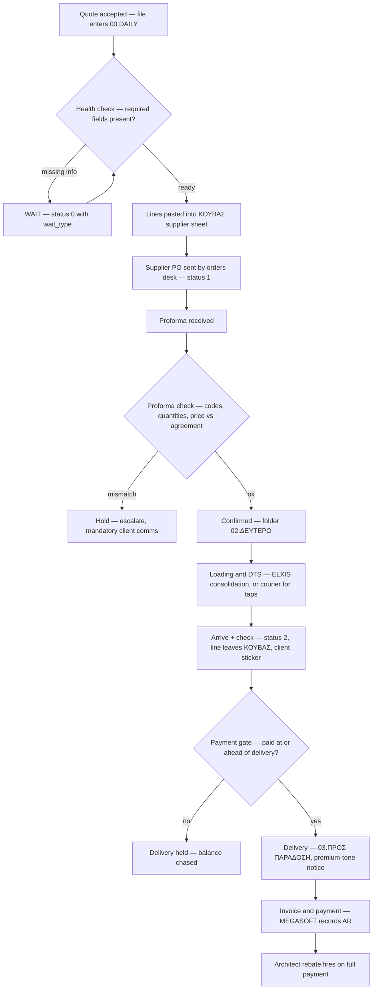
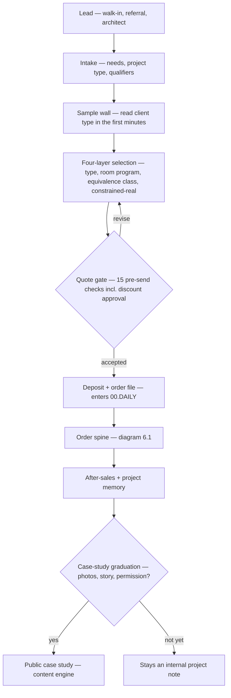
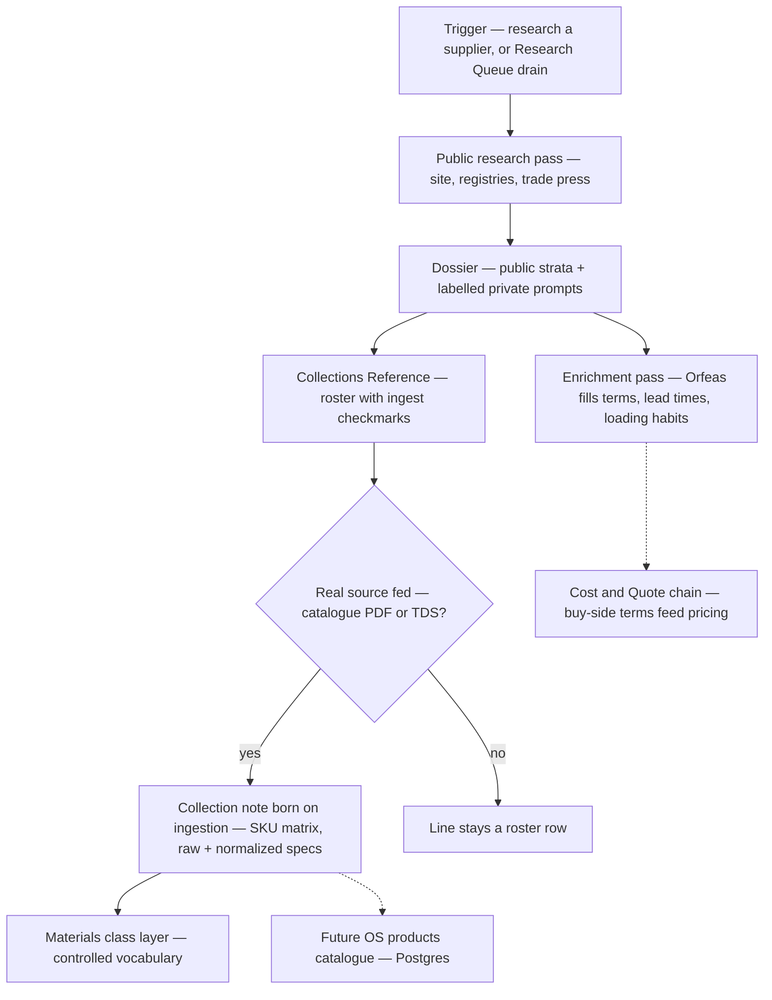
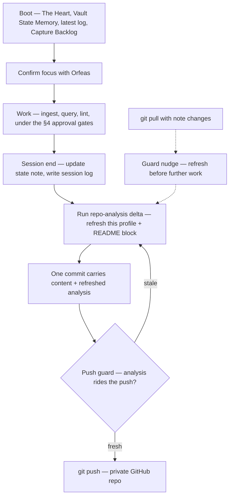
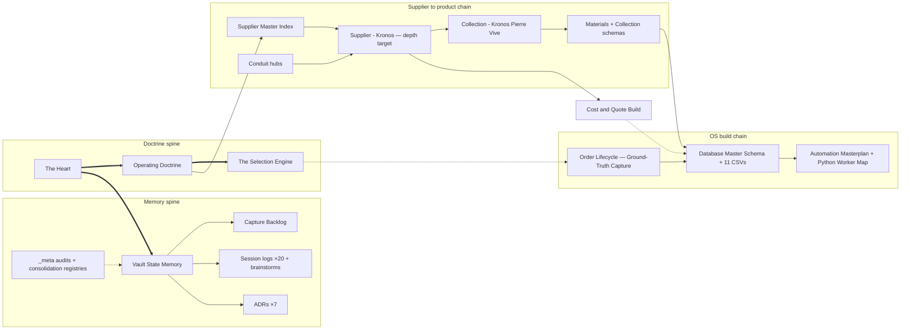

# Afoi Deli Vault — Living Repository Analysis

**Analysis v1.4** · **Last analyzed:** 2026-07-19 · **Snapshot commit:** 6bdac9f (+ the 2026-07-19 working tree — the consolidation-programme adoption + first baseline — committed immediately after; v1 baseline e686ba9)

> Generated by the `/repo-analysis` skill (`.claude/skills/repo-analysis/SKILL.md`). Regenerated on every push/pull per `CLAUDE.md` §8 and ADR-0006 (`14_AI_COLLABORATION/Architecture Decision Records.md`). **Do not hand-edit** — changes will be overwritten on the next run. This document is Claude-maintained reference layer: it describes, it never decides.

---

## 1. At a glance

This repository is the **Afoi Deli Second Brain** — a unified Obsidian vault serving as knowledge layer and operating system for both **Afoi Deli Floor + Bath** (ΑΦΟΙ ΔΕΛΗ Ε.Ε., a premium Athens floor/bath materials merchant, founded 1986) and **Orfeas Delis personally**, the second-generation successor; business and personal are deliberately one fabric (`The Heart.md`). It follows the LLM-Wiki pattern: immutable raw sources feed an LLM-maintained, densely interlinked wiki governed by a root contract (`CLAUDE.md`), with one hard override — doctrine, journal, and strategic framing are authored only by Orfeas. Structurally it is 193 notes across a numbered-folder taxonomy (business domains `00`–`11`, personal wing `12`–`17`, system layers `97`–`99`, `_meta`, `docs`, plus a new `scripts/` deterministic-tooling layer), navigated by wikilinks rather than tags, with a session-ritual memory spine (`14_AI_COLLABORATION/Vault State Memory.md`) that makes every working session compound. Its strategic center of gravity is supplier intelligence (`04_SUPPLIERS_AND_BRANDS`) and the specification of a 5-layer "Afoi Deli OS" (Obsidian → Supabase Postgres → Python worker → interface → AI agent) of which — by the vault's own honest accounting — only Layer 1 currently runs. As of 2026-07-19 the vault operates under a **governed consolidation & enrichment programme** (`14_AI_COLLABORATION/Consolidation and Enrichment Programme.md`, ADR-0007): its first baseline (`docs/VAULT_BASELINE_2026-07-19.md` + the `_meta/consolidation/` registries) maps every canonical owner, overlap cluster, and the 49-correction tracer landing matrix — with a hard rule that no consolidation executes before Orfeas's review.

## 2. Snapshot metrics

All counts computed deterministically by `.claude/skills/repo-analysis/scripts/vault_metrics.py` (UTF-8-safe; excludes `.git`, `.obsidian`, `.claude`, `.githooks`, `docs`).

| Metric | Value |
|---|---|
| Notes (`.md`) | **193** (4 at root) |
| Top-level folders on disk | 24 (23 per `99_SYSTEM/Vault Map.md` + the new `scripts/`, row pending); 22 carry notes — `97_CSV_SCHEMAS` holds only CSV contracts, `docs` the generated suite |
| Attachments | 11 `.csv` · 7 `.json` (baseline registries, `_meta/consolidation/data/`) · 2 `.html` · 2 `.pdf` · 1 `.svg` · 1 `.py` · 1 `.ps1` · 2 other |
| Wikilinks | **1,883** total · 1,809 resolved (96.1%) · 3 attachment links · 1 embed · 17 internal markdown links |
| Unique note→note edges | **1,123** |
| Broken link targets | 22 distinct — mostly intentional future stubs of the materials layer, see §8 |
| Distinct tags | 63+ (ornamental — navigation is folders + wikilinks by rule, `CLAUDE.md` §3) |
| Notes with `confidence` | 57 — verified 32 · memory_seed 12 · likely 10 · needs_check 3 |
| `status` distribution | active 95 · draft 44 · complete 26 · seed 10 · living 5 · idea 3 · backlog 2 · **off-set: `draft-for-verification` 1, `proposed` 1** |
| Notes missing frontmatter | 3 — `CLAUDE.md`, `README.md` (contracts, not notes), one `_sources` archive (+ the immutable raw programme draft in `14_AI_COLLABORATION/_sources/`, evidence-class) |
| Strict orphans (no links in or out) | 9 — 4 templates, 2 `_sources` archives, `README.md`, + the 2 known F3/dormant cases (see §8) |

**Top hubs by degree** (in + out unique edges):

| Note | In | Out | Degree |
|---|---|---|---|
| `14_AI_COLLABORATION/Vault State Memory.md` | 42 | 74 | 116 |
| `00_COMMAND_CENTER/Capture Backlog.md` | 37 | 68 | 105 |
| `The Heart.md` | 52 | 3 | 55 |
| `_meta/audits/2026-06-16-vault-audit.md` | 14 | 40 | 54 |
| `04_SUPPLIERS_AND_BRANDS/Suppliers/Kronos/Supplier - Kronos.md` | 33 | 14 | 47 |
| `14_AI_COLLABORATION/Architecture Decision Records.md` | 30 | 15 | 45 |
| `99_SYSTEM/Vault Map.md` | 24 | 19 | 43 |
| `01_COMPANY_CORE/Afoi Deli — Operating Doctrine.md` | 31 | 9 | 40 |

The hub profile matches the declared architecture unusually well: the two state notes (memory + backlog) are the busiest crossroads, and `The Heart.md` has the signature of a true root — 52 inbound, only 3 outbound. A note pointed *to* from everywhere that points almost nowhere itself.

## 3. Architecture

The vault is organized as **numbered folders by domain + aggressive wikilinking**, not PARA or Zettelkasten — closest to a Johnny-Decimal-flavored MOC system (each domain has an index/MOC note; `99_SYSTEM/Vault Map.md` is the single canonical folder index and explicitly forbids restating the taxonomy elsewhere). Five zones with distinct jobs:

1. **Doctrine root (above the structure):** `The Heart.md` — Orfeas-authored values, maxims, and lineage; everything inherits its register. `CLAUDE.md` operationalizes it as the per-session operating contract (boot order, conventions, approval gates, the ingest/query/lint loop).
2. **Steering & memory:** `00_COMMAND_CENTER` (the ranked work queue — `00_COMMAND_CENTER/Capture Backlog.md` — plus dashboards, several deliberately dormant) and `14_AI_COLLABORATION` (the memory spine: `14_AI_COLLABORATION/Vault State Memory.md` as single source of truth, 19 dated session logs, a brainstorm trail, 6 ADRs, session/audit/brainstorm protocols).
3. **Business reference layer (`01`–`11`):** identity and doctrine (`01`), the SOP-dense order spine (`02`), the data contracts (`03` + `97_CSV_SCHEMAS`), supplier intelligence — the gravity center (`04`), sales craft and projects (`05`/`06`), the three-tier materials layer (`07`), the OS/automation specification (`08`), and thin-but-strategic web/finance/growth domains (`09`–`11`).
4. **Personal wing (`12`–`17`):** operating disciplines, daily-note template, life rooms, venture ideas, and the journal — governed by the vault's strictest rule: read/reason freely, but the Journal and wellness notes are **author-by-invitation** (`CLAUDE.md` §5). Described here structurally only, by rule.
5. **System & governance:** `98_TEMPLATES` (15 manufacturing forms whose frontmatter defines each entity's contract), `99_SYSTEM` (rules, the canonical map, home notes for the two status-honest HTML visualizations at root — The Realm and the Operations Cockpit), `_meta` (the audit immune system — charter, STATE ledger, three dated reports — plus, since 2026-07-19, the **consolidation registries**: `_meta/consolidation/Overlap Registry.md`, `_meta/consolidation/Canonical Note Registry.md`, and the deterministic evidence pack in `_meta/consolidation/data/`), `scripts/` (deterministic tooling — `scripts/vault_baseline.py`), and `docs` (this generated suite + the baseline report `docs/VAULT_BASELINE_2026-07-19.md`). The governing frame for all consolidation work is `14_AI_COLLABORATION/Consolidation and Enrichment Programme.md` (ADR-0007).

*Legend: solid `-->` = explicit link structure · dashed `-.->` = inferred/lighter dependency · thick `==>` = the primary doctrine flow.*

**Knowledge flow (the note lifecycle).** A fact enters via the ingest loop (`CLAUDE.md` §6): source dropped → discussed → entity page with frontmatter + confidence → affected pages updated → session log entry. Raw sources are archived immutably in `_sources/` folders (e.g. `04_SUPPLIERS_AND_BRANDS/Suppliers/Kronos/_sources/`, `07_PRODUCT_KNOWLEDGE/Materials/_sources/`), notes carry a `confidence` ladder (`memory_seed` → `likely` → `verified`, with `needs_check` for flagged uncertainty), and periodic audits (`_meta/audits/`) reconcile drift. Two strata recur across the vault: an **idealized 2026-06-07 scaffold generation** and a **newer ground-truth/verified generation** (the tracer, the Kronos enrichment, the materials pilots) that explicitly wins where they disagree — the reconciliation debt is tracked in §8.

## 4. Knowledge model & taxonomy

**Frontmatter contract** (`CLAUDE.md` §3, policed by `_meta` audits): every note carries `type` (free-text human label — deliberately *not* a query facet; 60+ distinct values like `sop`, `supplier`, `schema`, `moc`, `session_log`), `created`, `status` ∈ {active, draft, seed, idea, complete, backlog} + `living` for foundation notes, and `confidence` ∈ {verified, likely, memory_seed, needs_check} where facts are involved. Naming is `Entity - Name` (`Supplier - Kronos`, `Template - Order`, `Session YYYY-MM-DD`). Links are bare note names by rule (folder-qualified links exist as drift — §8). Every new note must earn an **inbound** link in its creation session. Tags exist on some notes' frontmatter (63 distinct) but carry no navigation weight.

Two domains upgrade the generic contract to **typed, database-ready schemas**: `07_PRODUCT_KNOWLEDGE/Materials/Materials Schema.md` and `07_PRODUCT_KNOWLEDGE/Materials/Collection Schema.md` define typed fields with Postgres column mappings, controlled vocabularies, and a deterministic `confidence → verification_status` mapping; `03_DATABASE_DESIGN` pairs 10 entity notes with 11 header-only CSVs in `97_CSV_SCHEMAS` under an explicit precedence rule (CSV header = stored contract; the note annotates — audit P0-2, `03_DATABASE_DESIGN/Database Master Schema.md`).

**MOC / index register** (the navigation skeleton):

| Domain | Index note |
|---|---|
| Whole vault | `99_SYSTEM/Vault Map.md` (canonical) · `00_COMMAND_CENTER/Home Dashboard.md` (fan-out hub) |
| Memory / collaboration | `14_AI_COLLABORATION/Collaboration Home.md` · `14_AI_COLLABORATION/Vault State Memory.md` |
| Work queue | `00_COMMAND_CENTER/Capture Backlog.md` |
| Operations | `02_OPERATIONS_OS/Operations Map.md` |
| Data contracts | `03_DATABASE_DESIGN/Database Master Schema.md` |
| Suppliers | `04_SUPPLIERS_AND_BRANDS/Supplier Master Index.md` · `04_SUPPLIERS_AND_BRANDS/Brand Master Index.md` · `04_SUPPLIERS_AND_BRANDS/Supplier Enrichment Queue.md` |
| Sales | `05_SALES_AND_CLIENT_EXPERIENCE/Sales and Client Experience Map.md` |
| Projects | `06_PROJECTS_AND_CASES/Projects Dashboard.md` |
| Product / materials | `07_PRODUCT_KNOWLEDGE/Product Knowledge Map.md` · `07_PRODUCT_KNOWLEDGE/Afoi Deli — Materials Intelligence.md` |
| Automation | `08_AUTOMATION_AND_AI/Automation Masterplan.md` · `08_AUTOMATION_AND_AI/Automation Backlog.md` |
| Growth | `11_EXPANSION_AND_VENTURES/Expansion Map.md` · `10_FINANCE_AND_MANAGEMENT/Management Dashboard.md` (09 has no intra-folder MOC — §8) |
| Personal wing | `12_PERSONAL_OS/Personal Operating System.md` · `15_PERSONAL_LIFE/Personal Life — Home.md` · `16_IDEAS_AND_VISION/Ideas and Vision — Home.md` · `17_JOURNAL/Journal.md` |
| Governance | `_meta/audits/Vault Integrity Audit.md` (charter) · `_meta/audits/STATE.md` (findings ledger) |

## 5. Business model

*(Synthesis across `01_COMPANY_CORE`, `04_SUPPLIERS_AND_BRANDS`, `05_SALES_AND_CLIENT_EXPERIENCE`, `10_FINANCE_AND_MANAGEMENT`, and the tracer ground truth in `02_OPERATIONS_OS/Order Lifecycle — Ground-Truth Capture.md`. A Business-Model-Canvas-style overlay is used deliberately here; the vault itself organizes these facts by domain. Per the confidentiality rule, no commercial figures are restated — the notes holding them are cited instead.)*

**Core engine — stated doctrine:** merchant economics. "Never forget that we are merchants" — buy goods, sell them, carry the risk in between (`The Heart.md`). Afoi Deli is a premium **import distributor of architectural surfaces and bath** (tiles, large slabs, sanitaryware, faucets, bathroom furniture, outdoor, plus Scavolini kitchens), sourcing predominantly from Italian houses (~120 suppliers stated, `needs_check`, in `01_COMPANY_CORE/Afoi Deli Master Profile.md`) and selling through two Athens showrooms (Peristeri + Kolonaki) and afoideli.gr (WooCommerce).

**The moat — stated:** the **uplift engine**, not the brand portfolio (`01_COMPANY_CORE/Afoi Deli — Operating Doctrine.md`). Value flows *from* Afoi Deli *to* the brands: staging (showroom, taste, discretion) plus conversion (the closing craft, personified by Chrysoula "the closer") make any carried brand more premium than it is alone. The operating expression is **no-promise selling** and "create the circumstances so that others ask — never ask." The documented conversion half — `05_SALES_AND_CLIENT_EXPERIENCE/The Selection Engine.md` — records a deliberately high walk-in conversion rate (the figure lives in that note) achieved on human craft upstream of any system, with no tail follow-up by design.

**Segments:** retail homeowners, architects/designers ("authority specifiers" — the rebate channel), contractors/developers, hotel/villa owners — enumerated as a controlled list in `03_DATABASE_DESIGN/Clients Schema.md` and given distinct selection criteria in the Selection Engine.

**Supply-side structure:** identity brands (Kronos, Cielo, Fantini, Mutina, Scavolini — full dossiers) reach Afoi Deli via **conduits** — independent representative offices (`04_SUPPLIERS_AND_BRANDS/Conduit - Plus Interiors.md`, `04_SUPPLIERS_AND_BRANDS/Conduit - Filon IKE.md`) — under an explicit power-geometry doctrine: the conduit is structurally replaceable, the brand is not, and the client always turns to Afoi Deli (the responsibility doctrine). Inbound logistics run via forwarder **ELXIS** with Italian consolidation → sea freight to Patras → Aspropyrgos → the Peristeri warehouse; taps ride couriers (tracer batch D). Consolidation economics is named a core margin lever.

**Money mechanics (mechanics stated; figures live in the cited notes):** the pricing chain is **list → net → landed → sell** — supplier list price through a per-supplier compounding discount cascade, plus transport/pallet allocation folded *into* cost and marked up, plus a margin policy deliberately left for Orfeas to author (`10_FINANCE_AND_MANAGEMENT/Cost & Quote Build.md`). The completed tracer (`02_OPERATIONS_OS/Order Lifecycle — Ground-Truth Capture.md`) hardens the reality behind that chain: **pricing is intuition within a working markup band** (the band lives in the tracer note; flexed by job desirability, effort, negotiation, and the month's break-even against payables), and — the load-bearing finding — **realized per-order margin is not computed today** (the profit loop never closes after the sale; audit F7 confirmed from the inside). Working capital runs on two separate ledgers: client **accounts-receivable mirrors MEGASOFT** (individuals get a fused ΔΑ-ΤΙΜΟΛΟΓΙΟ, companies a delivery note then a coupled invoice), while supplier **accounts-payable lives in Kostas's personal Excel** — a wholly separate system of record, scheduled on an intuition-driven cycle (cadence in the tracer note). Payment gates delivery under a soft, tact-mediated rule over a hard `paid ≥ delivered` invariant; an architect **rebate** fires on full payment (case-by-case; sometimes inside the margin, sometimes on top; a VAT-offsetting services invoice preferred). Buy-side terms are verified for Kronos only (`04_SUPPLIERS_AND_BRANDS/Suppliers/Kronos/Supplier - Kronos.md`, private fields).

**Growth portfolio:** seven strategic axes (`01_COMPANY_CORE/Strategic Axes.md`) and six scored expansion paths (`11_EXPANSION_AND_VENTURES/Expansion Map.md`) — Scavolini kitchens (whole-interior authority), outdoor showroom, stock-house e-shop (explicitly gated on clean data), hotels/real estate, an AI construction-materials platform (externalize the internal OS only after internal proof), personal brand. Venture concepts further out live in `16_IDEAS_AND_VISION` (The Material Atelier, Mnemonic Atelier, Circles).

**The build thesis — inferred, and confirmed by the vault's own brainstorm:** the vault treats **operational intelligence as the compounding asset** — process codification (SOPs → exceptions → prevention rules → automation candidates) plus proprietary supplier/material knowledge are what the 5-layer OS is meant to industrialize. The 2026-06-17 brainstorm (`14_AI_COLLABORATION/Brainstorms/Brainstorm 2026-06-17.md`) states the honest gap: *"the vault is a specification with no instance"* — hence the lead thread, the **tracer** (walking one real closed order end-to-end). As of 2026-07-18 the tracer's **interview is complete (batches A–G), producing 49 schema-corrections and the first real operational instance**; what remains is the *final landing* — turning those corrections into the data schema (§8).

*Legend: solid `-->` = stated relationship · dashed `-.->` = inferred/secondary · thick `==>` = the primary value flow. The `moat -.-> houses` edge is the uplift loop: earned standing makes brands come to Afoi Deli, improving terms.*

## 6. Workflow catalog

The vault documents ~30 workflows. The four load-bearing ones are drawn; the rest are cataloged in the table below.

### 6.1 The order spine (status 0–4 · ΚΟΥΒΑΣ · folder states)

Owner: operations/orders desk; codified in `02_OPERATIONS_OS/Order Workflow 0-4.md`, `02_OPERATIONS_OS/Kouvas System.md`, `02_OPERATIONS_OS/Folder State Machine.md` and per-stage SOPs; **ground truth** (which wins on conflict) in `02_OPERATIONS_OS/Order Lifecycle — Ground-Truth Capture.md`.

### 6.2 The sales floor (intake → selection → quote → memory)

Owner: Orfeas/sales; `05_SALES_AND_CLIENT_EXPERIENCE/Sales and Client Experience Map.md`, `05_SALES_AND_CLIENT_EXPERIENCE/The Selection Engine.md`, `05_SALES_AND_CLIENT_EXPERIENCE/Quote Creation Checklist.md`, `06_PROJECTS_AND_CASES/Projects Dashboard.md`.

### 6.3 Supplier intelligence (research → dossier → enrichment → collections)

Owner: Claude researches/records, Orfeas enriches private truth; `04_SUPPLIERS_AND_BRANDS/Supplier Research Workflow.md`, `04_SUPPLIERS_AND_BRANDS/Supplier Enrichment Queue.md`, `07_PRODUCT_KNOWLEDGE/Materials/Collection Schema.md` (ADR-0005).

### 6.4 The memory loop (session ritual + the git-sync guard)

Owner: Claude executes, Orfeas approves; `CLAUDE.md` §1/§6/§8, `14_AI_COLLABORATION/Session Protocol.md`, ADR-0006. This is the loop that regenerates the document you are reading.

### 6.5 The rest of the catalog

| Workflow | Trigger | Owner | Evidence |
|---|---|---|---|
| Capture Backlog session loop | every session start/end | Orfeas + Claude | `00_COMMAND_CENTER/Capture Backlog.md` |
| Research Queue add/drain | supplier/URL surfaces mid-work | Orfeas capture / Claude drain | `00_COMMAND_CENTER/Research Queue.md` |
| The tracer — guided walk of one real order | Root A lead thread; **interview complete (A–G)**, final landing next | Orfeas narrates, Claude records | `02_OPERATIONS_OS/Order Lifecycle — Ground-Truth Capture.md` |
| Daily order processing | order file lands in 00.DAILY | operations | `02_OPERATIONS_OS/Daily Order Processing SOP.md` |
| Supplier PO creation | ΚΟΥΒΑΣ lines ready | orders desk | `02_OPERATIONS_OS/Supplier PO Creation SOP.md` |
| Proforma checking | proforma received | operations | `02_OPERATIONS_OS/Proforma Checking SOP.md` |
| DTS / loading tracking | loading date arrives | operations | `02_OPERATIONS_OS/DTS and Loading Date SOP.md` |
| Warehouse receiving | goods arrive | warehouse | `02_OPERATIONS_OS/Warehouse Receiving SOP.md` |
| Delivery scheduling | lines reach status 2 | operations/logistics | `02_OPERATIONS_OS/Delivery Scheduling SOP.md` |
| Finance & credit tracking | 10 money moments | finance | `02_OPERATIONS_OS/Finance and Credit Terms SOP.md` |
| Exception handling | 11 coded exceptions | operations | `02_OPERATIONS_OS/Exception Handling Rules.md` |
| Schema change discipline | any stored-column change | Claude (reference layer) | `03_DATABASE_DESIGN/Database Master Schema.md` |
| Materials class-note build | "build the material note" | Claude executes | `07_PRODUCT_KNOWLEDGE/Materials/Materials Research Workflow.md` |
| Python worker jobs ×5 (specified, not built) | Gmail/folder/schedule events | future worker; human approves sends | `08_AUTOMATION_AND_AI/Python Worker Map.md` |
| Hermes capture queue (planned) | Telegram `/add` | Orfeas triggers | `08_AUTOMATION_AND_AI/Hermes Telegram Capture Queue.md` |
| Cost & quote build — 5-step chain | pricing any quoted line | mechanical steps Claude; policy Orfeas | `10_FINANCE_AND_MANAGEMENT/Cost & Quote Build.md` |
| Venture evaluation | new expansion idea | Orfeas | `11_EXPANSION_AND_VENTURES/Expansion Map.md` |
| Vault integrity audit | ~10 sessions / monthly; doctrine pivots | Claude read-only, Orfeas disposes | `_meta/audits/Vault Integrity Audit.md` |
| Consolidation baseline → review → execute | programme passes (ADR-0007); baseline → Orfeas's hard gate | Claude proposes, Orfeas approves | `14_AI_COLLABORATION/Consolidation and Enrichment Programme.md`, `docs/VAULT_BASELINE_2026-07-19.md` |
| Strategic brainstorm | inflection points | Claude runs, Orfeas decides | `14_AI_COLLABORATION/Strategic Brainstorm Protocol.md` |
| ADR lifecycle | architectural decision | Orfeas decides, Claude records | `98_TEMPLATES/Template - ADR.md` |
| Journal entry (author-by-invitation) | Orfeas chooses to write | Orfeas only; Claude indexes | `17_JOURNAL/Journal.md` |
| Personal weekly review / daily note | weekly / daily (not yet practiced — §8) | Orfeas | `12_PERSONAL_OS/Personal Weekly Review.md`, `13_DAILY_NOTES/Daily Note Template.md` |

## 7. Relationship map

Domain-level concept graph. Explicit edges are verified wikilink paths; dashed edges are inferred functional dependencies.

*Legend: solid `-->` = explicit wikilink relationship · dashed `-.->` = inferred dependency · thick `==>` = doctrine/boot flow. Reading guide: the left spine is who we are (doctrine) and where we are (memory); the right half is the two build chains — supplier knowledge deepening into product data, and operational ground truth hardening into database + automation contracts. `The Heart ==> Vault State Memory` is the literal boot order every session follows.*

**Bridge notes** (connect otherwise-separate clusters — inferred from degree + cross-domain links): `00_COMMAND_CENTER/Capture Backlog.md` (strategy ↔ execution), `02_OPERATIONS_OS/Order Lifecycle — Ground-Truth Capture.md` (operations ↔ data design), `10_FINANCE_AND_MANAGEMENT/Cost & Quote Build.md` (supplier terms ↔ pricing ↔ OS), and `16_IDEAS_AND_VISION/The Material Atelier.md` (business supplier-intelligence ↔ personal venture wing).

## 8. Strengths, risks & next steps

### Strengths (evidence-anchored)

1. **A real root, honored in the graph.** `The Heart.md` (in 48 / out 3) genuinely sits above the structure, and doctrine chains cleanly: Heart → `01_COMPANY_CORE/Afoi Deli — Operating Doctrine.md` → domain doctrine (`05_SALES_AND_CLIENT_EXPERIENCE/The Selection Engine.md`, dossier callouts).
2. **A working memory spine.** 19 session logs + `14_AI_COLLABORATION/Vault State Memory.md` + 6 ADRs + a brainstorm trail form an unbroken compounding record; boot and exit rituals are codified (`CLAUDE.md` §1/§8, `14_AI_COLLABORATION/Session Protocol.md`) — and as of ADR-0006, the exit ritual has its first hook-backed enforcement.
3. **An immune system.** `_meta/audits/` holds a charter, a forward-looking STATE ledger, three dated reports, and institutionalized lessons (the UTF-8 em-dash false-positive is documented so it can never recur silently).
4. **Honest state accounting.** The vault says of itself that only Layer 1 runs ("a specification with no instance", `14_AI_COLLABORATION/Brainstorms/Brainstorm 2026-06-17.md`); the visualizations at root are status-honest by design (`99_SYSTEM/Afoi Deli — The Realm.md`).
5. **Contract-grade knowledge layers.** The two-strata supplier dossiers with a visible enrichment contract (`04_SUPPLIERS_AND_BRANDS/Supplier Enrichment Queue.md`) and the typed, Postgres-mapped materials schemas (`07_PRODUCT_KNOWLEDGE/Materials/Materials Schema.md`) are unusually rigorous for a personal vault.
6. **Link health.** 95.8% of 1,757 wikilinks resolve; most "broken" targets are intentional future stubs of the materials roadmap, not rot.

### Risks (prioritized)

| # | Severity | Finding | Evidence |
|---|---|---|---|
| R1 | **High** | **Confidential buy-side figures are restated beyond their home note.** The Kronos discount cascade / credit terms — marked confidential in the dossier — recur in plaintext in `04_SUPPLIERS_AND_BRANDS/Supplier Enrichment Queue.md`, `10_FINANCE_AND_MANAGEMENT/Cost & Quote Build.md`, `14_AI_COLLABORATION/Vault State Memory.md` §5/§7, and `14_AI_COLLABORATION/Sessions/Session 2026-06-17c.md`. The private repo mitigates, but every restatement widens the blast radius of any future leak or screen-share. **Now formally tracked as cluster OV-08 in `_meta/consolidation/Overlap Registry.md`** (redaction-to-pointers proposed; the Cost & Quote Build fork is a pending Orfeas decision); the baseline's critic also added the revenue-figure pair (`01_COMPANY_CORE/Afoi Deli Master Profile.md` + the state note). | baseline 2026-07-19, OV-08 |
| R2 | **High** | **SOP ↔ ground-truth reconciliation debt — now fully *specified*, not yet *applied*.** The tracer **interview is complete (A–G, 49 corrections, 2026-07-18)**, so the debt is now precisely enumerated but larger: `02_OPERATIONS_OS/Order Workflow 0-4.md`, `02_OPERATIONS_OS/Kouvas System.md` (no 4-date funnel, no two-place line membership, no line-split mechanic), and `02_OPERATIONS_OS/Operations Map.md` (statuses 3–4 "future" vs canonical) still carry the idealized 2026-06-07 layer; and `03_DATABASE_DESIGN` is now known to be missing MEGASOFT, rebates, an **inventory/`stock_items` (ΣΚΟΥΠΑ)** entity, a **`transport_claim`** receivable, the ΔΑ/τιμολόγιο **documents** model, and **Kostas-Excel AP** as a second source of truth. Realized per-order margin is confirmed uncomputed (F7). | `02_OPERATIONS_OS/Order Lifecycle — Ground-Truth Capture.md`, `_meta/audits/STATE.md` |
| R3 | Medium | **Phantom artifact:** the "Builder's Manual R0–R3" is cited in `14_AI_COLLABORATION/Vault State Memory.md` §4 and `14_AI_COLLABORATION/Roadmap.md` but exists nowhere on disk. Marked for the strike-list in the baseline's mechanical batch (`docs/VAULT_BASELINE_2026-07-19.md` §16-C). | baseline S1 |
| R4 | Medium | **Stale steering docs:** `14_AI_COLLABORATION/Roadmap.md` and `14_AI_COLLABORATION/Open Questions.md` predate the Root-A pivot (flagged in `CLAUDE.md` §1); `00_COMMAND_CENTER/Current Priorities.md` and `00_COMMAND_CENTER/Questions To Resolve.md` (2026-06-07, unrevised) coexist with `00_COMMAND_CENTER/Capture Backlog.md` as a second steering voice. The baseline found **10 confirmed steering conflicts** and routed each note's fate to Orfeas's review (`docs/VAULT_BASELINE_2026-07-19.md` §4/§17; clusters OV-09/10/11/13/14). | baseline §4 |
| R5 | Medium | **Frontmatter off-set values, emitted at the source:** `status: draft-for-verification` (×1) and `status: proposed` (×1) exist because `98_TEMPLATES/Template - ADR.md` emits `proposed` and `98_TEMPLATES/Template - Project.md` emits an empty status — audit findings F1/F2, still open. 10 of 15 templates hardcode `created: 2026-06-07`. | metrics + reader pass 98 |
| R6 | Medium | **Duplicate/orphaned scaffolds:** `04_SUPPLIERS_AND_BRANDS/Supplier Note System.md` (0 inbound, superseded by the Research Workflow — audit F3); 4 of 15 templates orphaned; `13_DAILY_NOTES` holds a template and zero practiced daily notes; `00_COMMAND_CENTER/Weekly Review.md` flagged dormant but still `status: active`. | metrics `strict_orphans` + reader passes |
| R7 | Medium | **Dual-home divergence:** `07_PRODUCT_KNOWLEDGE/Materials/Materials Research Workflow.md` is written as a SKILL.md that invites copying into `.claude/skills/` — two homes that will silently diverge. (`04_SUPPLIERS_AND_BRANDS/Supplier Research Workflow.md` has the same shape.) | reader pass 07 |
| R8 | Low | **Link-convention drift:** folder-qualified wikilinks persist across many notes (the baseline counted **86 path-style links**, e.g. in `00_COMMAND_CENTER/Home Dashboard.md`, `01_COMPANY_CORE/Strategic Axes.md`, `11_EXPANSION_AND_VENTURES/Expansion Map.md`) against the bare-name rule; `[[Mutina]]`/`[[Laufen]]` bare-brand links and a client-named broken link in `05_SALES_AND_CLIENT_EXPERIENCE/The Selection Engine.md` point at non-existent notes. | metrics `broken_targets` + baseline |
| R9 | Low | **Front-door drift, partially fixed this run:** `README.md` routed readers to the pre-pivot `README_START_HERE.md` and restated a truncated folder list — the generated block now corrects this, but `README_START_HERE.md` itself still awaits its rewrite (audit P2). | reader pass 98-99-root |

*(Intentional-stub broken targets — `Countertop Materials`, `Large-Format Porcelain Slab`, `Solid Surface Composite`, etc. — are the materials-layer roadmap, not rot; they are excluded from R8.)*

### Next steps (highest leverage first)

1. **The tracer interview is complete (A–G) — execute the final landing.** Turn the 49 corrections into the schema-diff: reconcile `02_OPERATIONS_OS/Order Workflow 0-4.md` / `02_OPERATIONS_OS/Kouvas System.md` / `02_OPERATIONS_OS/Operations Map.md` to ground truth, and land the newly-surfaced entities in `03_DATABASE_DESIGN` — MEGASOFT + rebates, inventory/`stock_items` (the ΣΚΟΥΠΑ ledger), `transport_claim`, the ΔΑ/τιμολόγιο documents model, and Kostas-Excel AP as its own source of truth (closes R2, unblocks the OS data layer).
2. **Consolidate confidential figures to single homes** (dossier private fields + `10_FINANCE_AND_MANAGEMENT/Cost & Quote Build.md` if needed), replacing restatements with links (R1).
3. **Fix the two template emitters** (`98_TEMPLATES/Template - ADR.md`, `98_TEMPLATES/Template - Project.md`) and re-status the two off-set notes (R5 — small, closes audit F1/F2).
4. **Resolve the phantom Builder's Manual reference** and refresh `14_AI_COLLABORATION/Roadmap.md` to the Root-A sequencing; decide the fate of `00_COMMAND_CENTER/Current Priorities.md` (R3/R4).
5. **Retire or merge** `04_SUPPLIERS_AND_BRANDS/Supplier Note System.md` and the four orphaned templates; apply the dormancy markings already decided for `00_COMMAND_CENTER/Weekly Review.md` (R6).
6. **Pick one home** for the Materials/Supplier research workflows (vault note *or* skill, with a pointer from the other) before they diverge (R7).

## 9. Changelog

### 2026-07-19 · Analysis v1.4 · snapshot 6bdac9f (+ same-day working tree)
- **The Consolidation & Enrichment Programme adopted (ADR-0007)** from an external draft (raw kept immutable in `14_AI_COLLABORATION/_sources/`; working charter `14_AI_COLLABORATION/Consolidation and Enrichment Programme.md`) with four reconciliations (confidence enum unchanged · one execution queue · frontmatter fields deferred to a post-baseline ADR · homes born on ingestion). Same session: the unlogged 2026-07-13 ΕΡΓΟΣΤΑΣΙΑ supplier sweep was **discarded at Orfeas's decision** (held in git stash as cooling period; redo via the programme's ingestion pipeline).
- **First consolidation baseline ran** (Pass 0–2, read-only, deep multi-agent: `scripts/vault_baseline.py` + 8 domain readers + audit-critic verification — 67 confirmed / 1 deflated / 1 rejected) → `docs/VAULT_BASELINE_2026-07-19.md` (18 sections incl. the **49-correction tracer landing matrix**, all dispositioned) + `_meta/consolidation/Overlap Registry.md` (17 clusters) + `_meta/consolidation/Canonical Note Registry.md` (~40 truth rows). **Hard gate: no consolidation executes until Orfeas reviews §17.**
- This profile: metrics refreshed (193 notes · 1,883 links · 1,123 edges); §1/§3 gained the programme + `scripts/` + `_meta/consolidation/` layers; §6.5 gained the baseline workflow row; R1/R3/R4/R8 re-anchored to the baseline's registers; **two of this suite's own policy breaches fixed** (the §5 markup-band/cadence restatement now existence-names its figures; the R8 client name anonymized — both flagged by the baseline's critic). Suite: `WORKFLOW_TREE` tracer-state line corrected (interview complete); `RELATIONSHIP_TREES` counts refreshed (×20 logs, ×7 ADRs); `VISION` header date + roadmap refreshed; `FAMILY_TREE` unchanged (no people-layer change).
- New notes: the charter · `14_AI_COLLABORATION/Sessions/Session 2026-07-19.md` · the two registries · the baseline report · the raw draft archive.

### 2026-07-18 · Analysis v1.3 · snapshot 1f0dd4c (+ same-day working tree)
- **The tracer interview completed — batches E, F, G — so the whole A–G guided walk of `02_OPERATIONS_OS/Order Lifecycle — Ground-Truth Capture.md` is settled.** The note grew to §1–§11 with **49 running schema-corrections** (was 21) and two new discoveries: **supplier AP lives in Kostas's Excel** (a system of record separate from MEGASOFT) and the **"ΣΚΟΥΠΑ" stock/inventory ledger** (the inventory layer the 11 CSVs never modeled). Batch F verified audit **F7 from the inside — realized per-order margin is not computed today**; batch E surfaced the non-atomic **line-split** mechanic and the uncaptured **transport-credit** receivable; batch G resolved the `ΤΡΙΤΟ`/`ΒΑΛΤΟΣ` states and the returns/breakage model.
- **`Mercareon` deleted as an entity** across all live notes (Orfeas: not a real thing); historical session logs keep it as a trail.
- Prose refreshed where the tracer changed meaning: §1 (note count), §5 (money mechanics + build thesis), §6.5 (tracer row), §8 R2 + next-step 1. Suite: `docs/VISION.md` (roadmap) revised; `WORKFLOW_TREE`/`FAMILY_TREE`/`RELATIONSHIP_TREES` unchanged (the tracer appears only generically there; no new notes/people/edges).
- Metrics: **188** notes (+1 session log) · **1,757** wikilinks (95.8% resolved) · **1,039** edges · status.complete 24→25. R2 (SOP↔ground-truth debt) is now fully *specified* (49 corrections) but larger in scope — the schema-diff is the top next step.
- New note: `14_AI_COLLABORATION/Sessions/Session 2026-07-18.md`.

### 2026-07-02 (third increment) · Analysis v1.2 · snapshot 42fab3b
- **README front page editorialized** (Orfeas's request): the generated block is now a scientific-register front page — abstract + keywords, numbered sections, and four inline compact diagrams (structure, workflow master tree, the **leads/active-threads** diagram sourced from `14_AI_COLLABORATION/Vault State Memory.md` §5, and the regeneration loop). The skill's README contract (`.claude/skills/repo-analysis/SKILL.md` output 4) codifies the fixed section order for idempotent regeneration.
- No vault-content change; docs-suite only.

### 2026-07-02 (later same day) · Analysis v1.1 · snapshot 7a06df2
- **Suite extended on Orfeas's request:** added the companion views — `docs/WORKFLOW_TREE.md` (hierarchical workflow tree), `docs/FAMILY_TREE.md` (the house of Deli + the lineage of ideas), `docs/RELATIONSHIP_TREES.md` (supply ecosystem · people · data contracts · memory spine), and `docs/VISION.md` (vision · workflow · novelties · end goal · roadmap, doctrine-compiled).
- `/repo-analysis` skill now regenerates the full suite every run; `CLAUDE.md` §8 step 4 and the README marker block updated accordingly; GitHub repo description set from `docs/VISION.md`; the README front section now opens with "The vision, in brief" — the condensed analytical description inside the generated block.
- No vault-content change in this increment — same reader evidence as v1; metrics unchanged except README-internal links. Figure policy tightened suite-wide after adversarial review: the walk-in conversion rate is now existence-named (the number stays in `05_SALES_AND_CLIENT_EXPERIENCE/The Selection Engine.md`), not restated.

### 2026-07-02 · Analysis v1 · snapshot e686ba9 (+ same-day working tree)
- **Initial full deep analysis** — 12 parallel domain readers over all 187 notes + deterministic metrics engine; document created.
- **Capability shipped this same session (ADR-0006):** `/repo-analysis` skill, `.claude/skills/repo-analysis/scripts/vault_metrics.py`, the git-sync guard (`.claude/hooks/git-sync-guard.mjs` + `.claude/settings.json` hooks), warn-only `.githooks/pre-push` + `post-merge` (`core.hooksPath`), `CLAUDE.md` §8 step 4, README marker block, `docs` row in `99_SYSTEM/Vault Map.md`, working-mode entry in `14_AI_COLLABORATION/Collaboration Home.md`.
- Vault state at first snapshot: 187 notes · 1,717 wikilinks (95.7% resolved) · 1,030 edges · 8 strict orphans · tracer at batch D of A–G · OS Layer 1 only.
- Risks R1–R9 surfaced (R1 confidential-figure spread and R2 SOP↔ground-truth debt are the headliners).

## 10. Methodology & provenance

- **Generator:** the `/repo-analysis` skill (deep mode) run by Claude in-session on 2026-07-02: 12 parallel domain-reader agents (one per folder group; structured output with per-claim evidence paths and stated-vs-inferred basis) + `.claude/skills/repo-analysis/scripts/vault_metrics.py` for every number in §2. Synthesis and diagrams by the orchestrating session; citations then verified deterministically (path-existence check) and the draft adversarially reviewed before commit.
- **Stated vs inferred:** claims tagged "stated" trace to explicit note content at the cited path; inferences (e.g. the "operational intelligence as compounding asset" thesis, the bridge-note list) are labeled as such in place. Diagrams distinguish the two by edge style.
- **Deliberate exclusions:** concrete commercial figures (discounts, prices, credit terms, revenue) are never restated here — the cited notes hold them. The personal wing (`12`–`17`) is described structurally only; the Journal's content is not summarized. Composition pie charts were omitted deliberately — the tables in §2/§4 carry the same information with smaller diffs.
- **Update contract:** see `.claude/skills/repo-analysis/SKILL.md`. Delta runs diff against the snapshot commit above, preserve this changelog verbatim, and regenerate only what changed. An unchanged vault re-run should produce a near-identical file.
