# Afoi Deli — Workflow Tree

**Generated 2026-07-19b · snapshot ff3c968** by the `/repo-analysis` skill — regenerated at every session end (`CLAUDE.md` §8, ADR-0006). **Do not hand-edit.**

This is the *hierarchical* view of every documented workflow in the vault: what belongs to what. The *sequential* view — stage-by-stage flowcharts with decision gates — lives in `docs/REPO_ANALYSIS.md` §6 (one source of truth per shape; this file does not duplicate the flowcharts).

## The master tree

```mermaid
graph TD
    root["The work of Afoi Deli — everything the vault codifies"]
    root ==> rev["Revenue engine — sell, procure, deliver, collect"]
    root ==> know["Knowledge engine — compound what only this house knows"]
    root ==> gov["Governance engine — keep the memory true"]
    root --> autox["Automation track — specified, not yet built"]
    root --> pers["Personal OS — the operator beneath the operation"]

    rev --> sales["Sales floor — intake · sample wall · quote gate"]
    rev --> order["Order spine 0-4 — ΚΟΥΒΑΣ · proforma · loading · payment gate"]
    rev --> logi["Inbound logistics — ELXIS consolidation · courier split"]
    rev --> fin["Money — pricing chain · credit calendar · rebates"]

    know --> supw["Supplier intelligence — research · dossier · enrichment"]
    know --> matw["Materials three-tier — class · collection · SKU"]
    know --> iql["Ingest / query / lint — the operating loop"]

    gov --> sess["Session ritual — boot · work · close · commit"]
    gov --> aud["Vault integrity audit — read-only, proposes only"]
    gov --> brain["Strategic brainstorm — think-with, promote deliberately"]
    gov --> ra["Living repo analysis — regenerates this very file"]

    autox --> worker["Python worker jobs ×5 — proforma · DTS · scanner · delivery · summary"]
    autox --> hermes["Hermes capture queue — Telegram to dossier"]

    pers --> daily["Daily note + weekly reviews — designed, not yet practiced"]
    pers --> fsys["Frustration → system → automation pipeline"]
```

*Legend: thick `==>` = the three live engines · solid `-->` = branch membership. 21 nodes; deeper stages below.*

## Branch detail — the revenue engine

Each leaf names its owner and its SOP. Decision gates are marked ◇.

- **Sales floor** — owner Orfeas/sales · `05_SALES_AND_CLIENT_EXPERIENCE/Sales and Client Experience Map.md`
  - Intake (needs, project type, qualifiers) · `05_SALES_AND_CLIENT_EXPERIENCE/Client Intake Checklist.md`
  - The Selection Engine (four layers: client type → room program → equivalence class → constrained-real) · `05_SALES_AND_CLIENT_EXPERIENCE/The Selection Engine.md`
  - ◇ Quote gate — 15 pre-send checks incl. discount approval · `05_SALES_AND_CLIENT_EXPERIENCE/Quote Creation Checklist.md`
- **Order spine** — owner operations/orders desk (Dimitris/Vicky per ground truth) · `02_OPERATIONS_OS/Operations Map.md`
  - Daily processing (00.DAILY intake, ◇ health check, WAIT taxonomy) · `02_OPERATIONS_OS/Daily Order Processing SOP.md`
  - ΚΟΥΒΑΣ procurement pool (per-supplier sheets, 4-date funnel) · `02_OPERATIONS_OS/Kouvas System.md`
  - Supplier PO → ◇ proforma check → confirmation · `02_OPERATIONS_OS/Supplier PO Creation SOP.md`, `02_OPERATIONS_OS/Proforma Checking SOP.md`
  - DTS/loading → arrive + check (status 2) → ◇ payment gate → delivery · `02_OPERATIONS_OS/DTS and Loading Date SOP.md`, `02_OPERATIONS_OS/Warehouse Receiving SOP.md`, `02_OPERATIONS_OS/Delivery Scheduling SOP.md`
  - Exceptions — 11 coded types with prevention rules · `02_OPERATIONS_OS/Exception Handling Rules.md`
  - **Ground truth wins on conflict** · `02_OPERATIONS_OS/Order Lifecycle — Ground-Truth Capture.md` (interview COMPLETE A–G, 49 schema-corrections; final landing = the #1 next action, mapped in `docs/VAULT_BASELINE_2026-07-19.md` §7)
- **Money** — owner finance/Orfeas · list → net → landed → sell (`10_FINANCE_AND_MANAGEMENT/Cost & Quote Build.md`), per-order margin (`10_FINANCE_AND_MANAGEMENT/Profitability Engine.md`), credit/due dates (`10_FINANCE_AND_MANAGEMENT/Credit and Due Date Calendar.md`), 10 money moments (`02_OPERATIONS_OS/Finance and Credit Terms SOP.md`)

## Branch detail — the knowledge engine

- **Supplier intelligence** — Claude researches, Orfeas enriches · "the Kronos treatment" (`04_SUPPLIERS_AND_BRANDS/Supplier Research Workflow.md`) → two-strata dossier → enrichment sweep (`04_SUPPLIERS_AND_BRANDS/Supplier Enrichment Queue.md`) → capture queue for new names (`00_COMMAND_CENTER/Research Queue.md`)
- **Materials three-tier** — class notes (`07_PRODUCT_KNOWLEDGE/Materials/Materials Schema.md`) → collections born on ingestion (`07_PRODUCT_KNOWLEDGE/Materials/Collection Schema.md`, ADR-0005) → SKUs in the future OS `products` table · runner: `07_PRODUCT_KNOWLEDGE/Materials/Materials Research Workflow.md`
- **Ingest / query / lint** — the standing loop every session runs (`CLAUDE.md` §6): sources are discussed before filing, answers become notes, drift is surfaced not silently fixed

## Branch detail — the governance engine

- **Session ritual** — boot (The Heart → state → log → backlog) · close (state → log → `/repo-analysis` → commit+push, guard-enforced) · `14_AI_COLLABORATION/Session Protocol.md`
- **Audit** — routine ~10 sessions/monthly, deep quarterly; 8 standing checks; writes only to `_meta/audits/` · `_meta/audits/Vault Integrity Audit.md`
- **Brainstorm** — read-only strategic grounding with a deliberate promotion step (log proposes, Orfeas disposes) · `14_AI_COLLABORATION/Strategic Brainstorm Protocol.md`
- **Living repo analysis** — this docs/ suite, regenerated every session end; a push guard blocks a stale push · `.claude/skills/repo-analysis/SKILL.md`
- **Consolidation programme (ADR-0007)** — baseline (deterministic registries + domain readers + adversarial critic) → **Orfeas's review gate** → passes execute (steering → tracer landing → interviews → ingestion → cases); one canonical home per truth, no silent deletion · `14_AI_COLLABORATION/Consolidation and Enrichment Programme.md`, `docs/VAULT_BASELINE_2026-07-19.md`, `_meta/consolidation/Overlap Registry.md`

## The automation track (specified, not built — honest status)

Five worker jobs (`08_AUTOMATION_AND_AI/Python Worker Map.md`), the Hermes capture queue (`08_AUTOMATION_AND_AI/Hermes Telegram Capture Queue.md`), five agent roles (`08_AUTOMATION_AND_AI/AI Agent Roles.md`) — all downstream of the data layer, which holds zero rows today. The build order is instance-first: the tracer validates reality before any of this runs (`14_AI_COLLABORATION/Brainstorms/Brainstorm 2026-06-17.md`).

## The personal OS

The operating premise: "your company will only become as clear, disciplined, and powerful as your own operating system" (`12_PERSONAL_OS/Personal Operating System.md`). Daily note + weekly reviews are designed but not yet practiced (`13_DAILY_NOTES/Daily Note Template.md`, `12_PERSONAL_OS/Personal Weekly Review.md`); the live pipeline is frustration → system note → automation candidate (`12_PERSONAL_OS/Deep Work and Focus.md`). Described structurally only, by rule.
